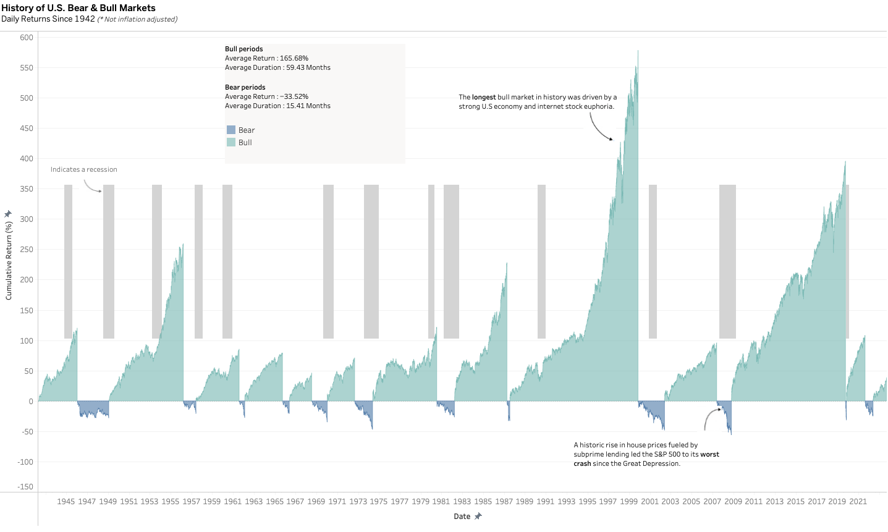

# Daily historical performance of the S&P 500 Index

# Project
This project intends to reproduce and display an informative chart about the History of U.S. Bear & Bull Markets, by analyzing the daily returns since 1942.
The chart of [First Trust](https://www.ftportfolios.com/COMMON/CONTENTFILELOADER.ASPX?CONTENTGUID=4ECFA978-D0BB-4924-92C8-628FF9BFE12D) has been taken as an inspiration.

# Data
The data used in this project is obtained from Yahoo Finance and contains the daily closing prices of the S&P 500 index from February 10th, 1942 to February 10th, 2024. The prices are not inflation adjusted.

# Structure
This repository contains a Jupyter notebook that collects the historical data of the S&P 500 from 1942 until today, and analyzes the bear and bull markets. It also demonstrates how to use Long Short-Term Memory (LSTM) neural networks to predict stock prices for the S&P 500 index. The notebook covers the following steps:

Exploratory data analysis and visualization
Data preprocessing and feature engineering
Building and training the LSTM model
Evaluating the model performance and making predictions.

# Chart visualization (Tableau)

# Price prediction model
The LSTM model can be found in the Jupyter Notebook and is implemented using TensorFlow and Keras.

The main goal of this project is to showcase how LSTM networks can capture the temporal dependencies and patterns in time series data, such as stock prices, and provide accurate forecasts for future values. However, this project is not intended to provide any financial advice or recommendations for trading or investing in stocks.

# Requirements
To run this notebook, you will need to run the requirements.txt

# Usage
To run this notebook, simply clone this repository and open it in Jupyter Notebook or Google Colab. You can also view it on GitHub.

